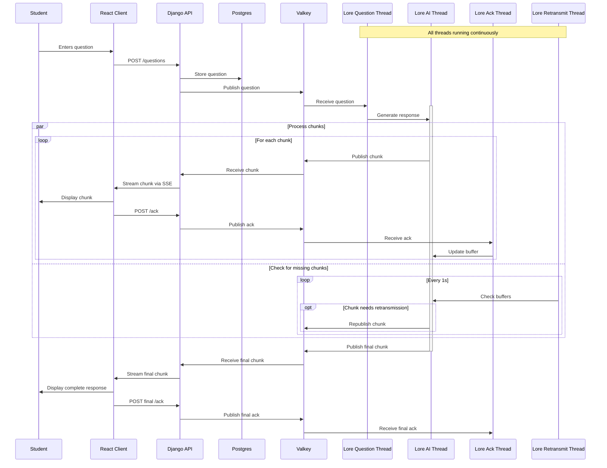

# Lore - Natural Language Learning Assistant

## Description

Lore is an AI-powered learning assistant service that uses the Mistral language model to provide natural language responses to student questions. It is designed to enhance the learning experience by providing contextual explanations while strictly avoiding code generation.

## Dependencies and Virtual Environment

[Install Pipenv](https://pipenv.pypa.io/en/latest/installation.html) for creating/managing virtual environment.

Then install dependencies and create the shell.

```bash
pipenv install
pipenv shell
```

## Getting Started

### Configuration

Create a `.env` file with the following variables, for you to test locally:

```env
HUGGING_FACE_HUB_TOKEN=token
VALKEY_HOST=localhost
VALKEY_PORT=6379
VALKEY_PASSWORD=password
MODEL_NAME=TinyLlama/TinyLlama-1.1B-Chat-v1.0
LOG_LEVEL=DEBUG
```

### Running the Service

Run the Lore service with the following command.

```bash
pipenv run python service/main.py
```

Then start the monitoring services with the following command.

```bash
docker compose -f monitoring/docker-compose.yml up -d
```

## Model Overview

In development, Lore uses the TinyLlama model. This is because it is faster to run locally, and the quality is still good enough for development purposes.

Lore utilizes the Mistral language model in production, a state-of-the-art Large Language Model (LLM) specifically fine-tuned for educational contexts. Key features:

- Optimized for natural language explanations
- Built-in safeguards against code generation
- Context-aware responses based on learning materials
- Maintains consistent educational tone

## System Architecture



