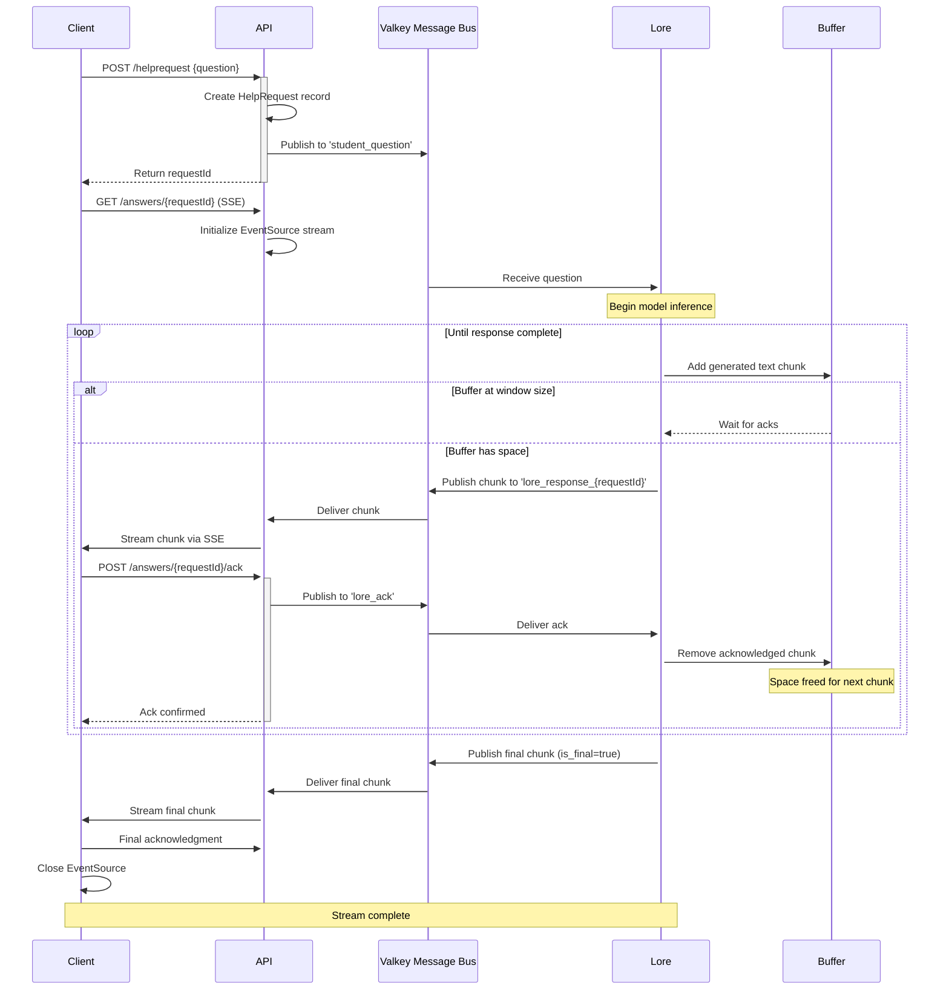

# Lore - Natural Language Learning Assistant

## Description

Lore is an AI-powered learning assistant service that uses the Mistral language model to provide natural language responses to student questions. It is designed to enhance the learning experience by providing contextual explanations while strictly avoiding code generation.

## Dependencies and Virtual Environment

[Install Poetry](https://python-poetry.org/) for creating/managing virtual environment.

Then install dependencies and create the shell.

```bash
poetry install
poetry shell
```

Required packages:
- poetry
- mistralai
- valkey
- pydantic

## Mistral Model Overview

Lore utilizes the Mistral language model, a state-of-the-art Large Language Model (LLM) specifically fine-tuned for educational contexts. Key features:

- Optimized for natural language explanations
- Built-in safeguards against code generation
- Context-aware responses based on learning materials
- Maintains consistent educational tone

## System Architecture



## Configuration
Create a `.env` file with the following variables:
```
MISTRAL_API_KEY=your_api_key
VALKEY_URL=your_valkey_url
REDIS_URL=your_redis_url
```

## Usage
The service listens for questions on the Valkey `student_question` channel and responds with natural language explanations. All responses are filtered to prevent code generation.
